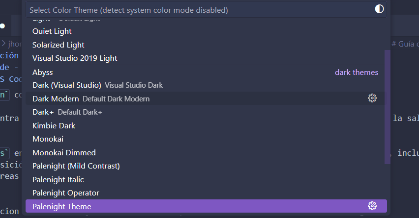

> 📋 **Guía Técnica**: Esta documentación establece los procedimientos para configurar un entorno de desarrollo en C# y otros lenguajes. Incluye las configuraciones necesarias para mantener consistencia en el desarrollo de software.

> **Nota importante**: Este documento se enfoca en aspectos técnicos y procedimientos. Para análisis comparativos, reflexiones personales y conclusiones, utiliza el archivo `CONCLUSIONES_EVALUACION.md`.

**Autores**: Laro y Jeremy 
**Fecha V0**: [Fecha de entrega inicial]
**Fecha V1**: [Fecha de entrega final]

---

## Visual Studio Code - Entorno Principal

### Instalación y Verificación

**Método de instalación:** [Desde la pagina oficial del Visual Studio Code: https://code.visualstudio.com/](screenshots/screenshot1.png)

> **💡 Sobre las imágenes**: Incluye capturas de pantalla para mostrar los diferentes pasos o resultados. Ejemplo: `

**Proceso de instalación:**
- **Descarga:**
 `Paso 1` [Ir a la pagina *http://code.visualstudio.com/*,](screenshots/screenshot1.png).
 `Paso 2` Presiona el botón Download for Windows o el del sistema operativo que utilices; se descargará un archivo instalador como VSCodeUserSETUP-X64.
- **Opciones del instalador:** 
  `Paso 3` Ubica el archivo descargado, ejecútalo, acepta los términos y condiciones [aceptar terminos y licencias!](screenshots/screenshot2.png) y haz clic en Next.
  `Paso 4` Selecciona la carpeta donde deseas instalarlo o deja la ruta predeterminada.
  `Paso 5`Decide si quieres modificar el nombre de la carpeta del menú Inicio o si prefieres no crear accesos directos allí. Luego haz clic en Next.
  `Paso 6` Marca las tareas adicionales que desees, como crear un acceso directo en el escritorio o añadir opciones al menú contextual del Explorador de Windows. Después presiona Next.
  `Paso 7` Haz clic en Install para comenzar la instalación.
  `Paso 8` Una vez finalizado, el programa estará listo. Presiona Finish para completar el proceso y abrir Visual Studio Code.
- **Verificación:**Al iniciar Visual Studio Code, si observas en la ventana principal opciones como "Open Folder", "New File", etc., significa que [la instalación fue exitosa.](screenshots/screenshot3.png)

*Es posible documentar múltiples métodos.*

### Uso Básico de VS Code

**Navegación y funcionalidades básicas:**

*La interfaz de VSCode se organiza en cinco áreas principales:*

`la barra de actividades` se sitúa en el extremo izquierdo y proporciona acceso directo a las vistas principales como Explorer, Search, Source Control, Run and Debug, y Extensions.

`La barra lateral` ocupa el espacio adyacente de la barra de actividades y muestra el contenido de la vista seleccionada. Cuando seleccionas el Explorer, por ejemplo, la barra lateral muestra la estructura de archivos y carpetas de tu proyecto actual.

`El grupo de edicion` constituye el área central donde se abren y editan los archivos. 

`EL Panel` se encuentra en la parte inferior y tiene la terminal integrada, los problemas detectados, la salida de depuración y los resultados de búsqueda.

`La Barra de Estados` en la parte inferior proporciona información contextual sobre el archivo actual, incluyendo el lenguaje de programación, la codificación, la posición del cursor y el estado del control de versiones.

*Edición de código*
 en el grupo de edicion es donde se ejecuta esta funcion,practicamente donde se escribe el codigo.

  *Uso de la paleta de comandos*
-  representa una de las características más potentes. Accesible mediante *Ctrl+Shift+P (Windows/Linux)* o *Cmd+Shift+P (macOS)*, proporciona acceso instantáneo a prácticamente cualquier comando disponible en el editor.Desde allí puedes ejecutar cualquier acción, como:

  ºCambiar el tema 

  ºInstalar extensiones [(Extensions: Install Extensions)](screenshots/screenshot7.png)

  *Gestión de archivos y carpetas* 
  Los espacios de trabajo en VSCode permiten organizar proyectos complejos que involucran múltiples carpetas o repositorios. Un espacio de trabajo puede incluir configuraciones específicas, extensiones recomendadas y ajustes de depuración particulares como:

  ºAbrir una carpeta: [Archivo → Abrir carpeta](screenshots/screenshot4.png)

  ºCrear archivos: clic derecho en el Explorador → [Nuevo archivo.](screenshots/screenshot5.png)

  ºGuardar: Ctrl + S

Personalización del Entorno

**Configuraciones aplicadas:**
[Describe aquí las personalizaciones que se llevaron a cabo.]

Ejemplos de configuraciones útiles (incluye solo las que consideres necesarias):

**Temas e íconos:**
Ejemplos:

Se añadió la extensión Palenight Theme para obtener un tema atractivo y moderno, inspirado en el estilo Material Design para [Visual Studio Code](screenshots/screenshot8.png)

**Configuración de fuentes:**
Ejemplos:

Se instaló la extensión Better Comments.
Esta herramienta mejora la manera de visualizar los comentarios, facilitando su lectura dentro del [código](screenshots/screenshot9.png)

**Atajos de teclado útiles:**
Ejecutar archivo → Ctrl + F5
Abrir paleta de comandos → Ctrl + Shift + P 
Abrir la configuración → Ctrl + , 
Mover una línea → Alt + ↑ o Alt + ↓
Ir a la definición → F12 
Formatear el documento → Shift + Alt + F []

**Configuración del editor:**

Formateo automático al guardar
Si "editor.formatOnSave": false, lo actualizaremos a:
"editor.formatOnSave": true,
Así, cada vez que guardes (Ctrl + S), el archivo se ajustará automáticamente según las reglas del lenguaje y el formateador [elegido](screenshots/screenshot22.png)

Ajuste de líneas largas (Word wrap)
Si "editor.wordWrap": "off", lo cambiaremos a:
"editor.wordWrap": "on"
Esto evita el desplazamiento horizontal cuando las líneas son muy extensas.
El texto se ajustará automáticamente al ancho de la ventana del [editor.](screenshots/screenshot22.png)

**Terminal integrada:**
- PowerShell como terminal predeterminado
  Esto Define que cada vez que abras la terminal integrada (Ctrl + ñ o Ctrl + ` ), se inicie una sesión de PowerShell en lugar de CMD u otro shell.


  `Configuración de perfil personalizado`
 esta es una Estructura básica de configuración, en el archivo settings.json de VS Code escribimos:
{
  "terminal.integrated.profiles.windows": {
    "NombreDelPerfil": {
      "path": "ruta/al/ejecutable",
      "args": [],
      "env": {},
      "icon": "nombre-del-icono",
      "color": "terminal.ansiColor"
    }
  },
  "terminal.integrated.defaultProfile.windows": "NombreDelPerfil"}

  La ubicación del archivo de configuración la encontraras en:
  -Windows: %APPDATA%\Code\User\settings.json
  -Linux/macOS: ~/.config/Code/User/settings.json

  `Perfil de desarrollo PowerShell personalizado`
{
  "terminal.integrated.profiles.windows": {
    "PowerShell Dev": {
      "path": "C:\\Windows\\System32\\WindowsPowerShell\\v1.0\\powershell.exe",
      "args": ["-NoLogo"],
      "env": {
        "DOTNET_ENVIRONMENT": "Development",
        "PATH": "${env:PATH};C:\\HerramientasInternas\\Scripts"
      },
      "icon": "terminal-powershell",
      "color": "terminal.ansiBlue"
    }
  },
  "terminal.integrated.defaultProfile.windows": "PowerShell Dev"
}
  Puedes definir perfiles adicionales
> **Personaliza según tus necesidades**: Estas son sugerencias basadas en prácticas comunes. Experimenta y documenta las configuraciones que encuentres más útiles para tu flujo de trabajo.> 💼 **Manual de Incorporación**: Esta guía establece los estándares del equipo para configurar entornos de desarrollo en C#. Cualquier nuevo desarrollador debe poder seguir estas instrucciones para configurar su entorno de trabajo de manera consistente con el resto del equipo.

### SDK .NET

**Proceso de instalación:**
Qué es?

El .NET SDK (Software Development Kit) contiene el compilador, las herramientas y las bibliotecas necesarias para crear, compilar y ejecutar aplicaciones en C#. 

1. **Descarga e instalación:** 

**DESCARGA**
  `Paso 1`Ir a la pagina oficial: [https://dotnet.microsoft.com/download](screenshots/screenshot24.png), selecciona la versión .NET 8.0 (LTS) o superior.

  `Paso 2` hacer click en el boton *descargar SDK X64 de .NET* o superior, se descargara un archivo insatalador [como:](screenshots/screenshot25.png) 

**Opciones del instalador:**
  `Paso 1` Buscaremos la direccion donde se guardo el archivo, ejecutamos el [archivo.exe](screenshots/screenshot25.png)
  
  `Paso 2` Ejecuta el instalador y sigue las instrucciones [predeterminadas.](screenshots/screenshot26.png)
  `Paso 3` al dar en *instalar* nos pedira permiso para instalacion le damos en *SI* y comenzara la [instalacion](screenshots/screenshot27.png)
  `Paso 4` esperamos que termine de instalar y por ultimo le damos en [cerrar](screenshots/screenshot28.png)
   
 **Verificación:** [Cómo comprobar que funciona]
`Paso 1` Despues de instalar podemos abrir la terminal integrada VS Code o una ventana de PowerShell y ejecutamos:

  dotnet [--version]

`Paso 2` Luego verifica la información completa del entorno:

  dotnet [--info]

### Configuración para C#

**Extensiones esenciales:**
- **Soporte oficial para C#**: 
 `Paso 1` Abre Visual Studio Code.
 `Paso 2` Ve al menú de Extensiones o presiona *Ctrl+Shift+X* (Windows/Linux) o *Cmd+Shift+X* [(Mac).](screenshots/screenshot30.png)
 `Paso 3`En la barra de búsqueda escribe el nombre de la extensión. Por ejemplo:
         C# (la oficial de Microsoft)
 Haz clic en la extensión que aparece en los resultados y Presiona [Instalar.+](screenshots/screenshot31.png)

**Configuraciones específicas para C#:** 
[Describir las configuraciones que se aplicaron, como formateo automático, intellisense, o configuraciones del compilador]
`Formateo automático del código`
Puedes configurar VS Code para que formatee automáticamente el código al guardar o pegar:

  Archivo: .vscode/settings.json
  {
    "[csharp]": {
    "editor.formatOnSave": true,
    "editor.formatOnPaste": true,
    "editor.defaultFormatter": "ms-dotnettools.csharp"
  }
  } 
 Esto usa el formateador integrado de la extensión de C# de Microsoft.
 Si usas .editorconfig, también puedes definir reglas más específicas de estilo (indentación, espacios, llaves, etc.).

 `IntelliSense y análisis de código`
La extensión oficial de C# (basada en OmniSharp o el nuevo LSP) habilita autocompletado, sugerencias y diagnósticos de errores en tiempo real.
Puedes ajustar su comportamiento con estas opciones:

  Archivo: .vscode/settings.json

  {
    "csharp.suppressDotnetInstallWarning": true,
    "omnisharp.enableRoslynAnalyzers": true,
    "omnisharp.enableEditorConfigSupport": true,
    "omnisharp.enableImportCompletion": true,
    "omnisharp.autoStart": true
  }
Estas opciones activan análisis avanzados (Roslyn), lectura de configuraciones .editorconfig y completado automático inteligente.

 `Configuración del compilador y ejecución`

Para controlar cómo se ejecutan o compilan tus proyectos C#, VS Code usa los archivos generados por .NET:
tasks.json → Define cómo se compila el proyecto (dotnet build)
launch.json → Define cómo se ejecuta o depura (dotnet run)
Un ejemplo básico:

// .vscode/launch.json
  {
    "version": "0.2.0",
    "configurations": [
      {
        "name": "Ejecutar programa C#",
        "type": "coreclr",
        "request": "launch",
        "preLaunchTask": "build",
        "program": "${workspaceFolder}/bin/Debug/net8.0/MiProyecto.dll",
        "cwd": "${workspaceFolder}",
        "console": "integratedTerminal",
        "stopAtEntry": false
      }
    ]
  }  

**Debugging básico en Visual Studio**

`1. Puntos de interrupción (Breakpoints)`

Definición: Marcadores que detienen la ejecución en una línea específica para inspeccionar variables, pila de llamadas, etc.

Dónde se pueden establecer: Líneas ejecutables (asignaciones, instrucciones dentro de bucles, llamadas a métodos).

Cómo agregar:

Clic en el margen izquierdo junto a la línea

Presionar F9

Menú: Depurar > Alternar punto de interrupción

Visualización: Círculo rojo en el margen; flecha amarilla indica la línea actual.

Gestión avanzada:

Deshabilitar/Habilitar: clic derecho > Deshabilitar/Habilitar punto de interrupción

Condicionales, acciones, etiquetas, exportación/importación: clic derecho > opciones

Grupos: organizar puntos de interrupción por escenario

`2. Puntos de interrupción desde ventanas del depurador`

Pila de llamadas: Ctrl + Alt + C, clic derecho > Insertar punto de interrupción en funciones.

Ventana desensamblado: Ctrl + Alt + D, clic en margen o F9 para instrucciones específicas.

`3. Iniciar depuración`

Presionar F5 o ir a Depurar > Iniciar depuración

La ejecución se detiene en los breakpoints y permite inspeccionar variables y pila de llamadas.

`4. Inspección de variables`

Opciones:

Hover sobre variable en editor para ver valor

Ventanas del depurador: Automático, Variables locales, Inspección (Watch)

Visualizadores: cadenas largas, objetos complejos, colecciones

Valores devueltos de métodos: en línea o ventanas Autos

Watch / Inspección: observar variables o expresiones específicas

Copia y edición: doble clic sobre el valor en ventanas Autos o Locals

`5. Ventanas de depuración`
Ventana	Descripción	Atajo
Automático	Variables alrededor de la línea actual	Ctrl + Alt + V, A
Variables locales	Variables del ámbito actual	Alt + 4

Expandir objetos y matrices

Cambiar formato numérico: clic derecho > Presentación hexadecimal

Búsqueda de variables en Autos/Locals

`6. Visualizadores`

Visualizador de cadenas: textos largos, XML, HTML, JSON

Visualizador de objetos tabulares: colecciones .NET (DataSet, IEnumerable)

Acceso: Hover sobre variable compatible → icono de lupa

Tip práctico: Concéntrate en los breakpoints, inspección de variables y ventana Locals/Watch para depuración diaria.

Flujo de trabajo básico con C#
Creación de proyecto
dotnet new console -n HolaMundo
cd HolaMundo
code .


Esto crea la carpeta HolaMundo con estructura básica:

HolaMundo/
├── bin/
├── obj/
├── Program.cs
└── HolaMundo.csproj

Ejemplo de código Program.cs
using System;

namespace HolaMundo
{
    class Program
    {
        static void Main(string[] args)
        {
            Console.WriteLine("¡Hola Mundo!");
        }
    }
}

*Comentarios sobre decisiones tomadas*

Se usa el namespace HolaMundo para organizar el código.

El método Main es el punto de entrada del programa.

Console.WriteLine() imprime texto en la consola.

**Depuración de código en VS Code**

`Lenguajes soportados`

Nativo: JavaScript, TypeScript, Node.js

Otros lenguajes: mediante extensiones desde el Marketplace

Copilot puede generar automáticamente la configuración de depuración (launch.json) para tu proyecto.

`Interfaz de depuración`
Elemento	Función
Vista Ejecutar y depurar	Información general sobre ejecución y depuración, configuración de launch.json
Barra de herramientas de depuración	Botones para acciones comunes: iniciar, pausar, detener, paso a paso
Consola de depuración REPL	Evaluación de expresiones mientras el código está detenido
Barra lateral de depuración	Visualizar pila de llamadas, breakpoints y variables
Menú Ejecutar	Accesos directos a comandos de ejecución y depuración
Antes de comenzar la depuración

Instalar la extensión adecuada si no es JS/TS/Node.

Definir la configuración de depuración:

Proyectos simples: VS Code depura el archivo activo

Proyectos complejos: crear launch.json (Copilot puede ayudar)

Establecer puntos de interrupción: clic en el margen junto al número de línea o F9

`Iniciar sesión de depuración`

Abrir el archivo a depurar.

Presionar F5 o usar Ejecutar y depurar.

Seleccionar el depurador adecuado de la lista disponible.

La barra de estado cambia de color (por defecto, naranja) y muestra la configuración activa.

`Acciones de depuración`
Acción	Tecla	Descripción
Continuar / Pausa	F5	Reanuda ejecución hasta siguiente breakpoint / pausa línea actual
Paso superior (Step Over)	F10	Ejecuta siguiente línea sin entrar en funciones
Entra en (Step Into)	F11	Entra en funciones o métodos para depurar línea por línea
Salir (Step Out)	Shift + F11	Sale de la función actual y continúa en el contexto anterior
Reiniciar	Ctrl + Shift + F5	Detiene y reinicia la depuración con la configuración actual
Detener	Shift + F5	Finaliza la sesión de depuración

`Consola de depuración REPL`

Evaluación de expresiones mientras el código está detenido

Abrir: Consola de depuración en el panel de depuración o Ctrl + Shift + Y

Soporta:

Sugerencias mientras escribes

Múltiples líneas con Shift + Enter

Resaltado de sintaxis, sangría y cierre automático de comillas según el lenguaje

`Depuración de múltiples objetivos`

Permite depurar varios procesos (por ejemplo, cliente y servidor)

Cada sesión se muestra como elemento de nivel superior en la pila de llamadas

La barra de herramientas de depuración indica la sesión activa

Cambiar sesión activa: menú desplegable de la barra de herramientas o selección en la pila de llamadas

Todas las acciones de depuración se aplican a la sesión activa
**Debugging en VS Code**
`1. Configuración de depuración`

Para escenarios complejos o aplicaciones grandes, se necesita un archivo launch.json que especifique:

Punto de entrada de la aplicación

Variables de entorno

Conexión a procesos en ejecución

VS Code guarda la configuración en .vscode/launch.json dentro del proyecto, o en la configuración de usuario/espacio de trabajo.

Para aplicaciones simples, puedes depurar sin configuración, usando F5; VS Code intentará ejecutar el archivo activo.

`2. Creación de launch.json`

Selecciona “Crear un archivo launch.json” en la vista Ejecutar y depurar.

VS Code detecta automáticamente el entorno; si no, selecciona manualmente.

Se crea la carpeta .vscode y el archivo launch.json en tu espacio de trabajo.

Puedes editar el archivo para agregar, modificar o eliminar configuraciones.

Ejemplo de configuración para Node.js:

{
  "version": "0.2.0",
  "configurations": [
    {
      "type": "node",
      "request": "launch",
      "name": "Launch Program",
      "skipFiles": ["<node_internals>/**"],
      "program": "${workspaceFolder}\\app.js"
    }
  ]
}


VS Code también soporta configuraciones compuestas para iniciar varias al mismo tiempo.

`3. Agregar configuraciones`

Botón “Agregar configuración” en la vista de depuración.

IntelliSense dentro del array de configuraciones del launch.json.

Menú: Ejecutar > Agregar configuración.

`4. Generar configuración con IA (Copilot)`

Abrir la vista de chat de Copilot (Ctrl+Alt+I) o desde el menú de la barra de título.

Usar el comando /startDebugging o un mensaje personalizado (ej. generar configuración de depuración para una app Express).

Aplicar la configuración sugerida y comenzar la depuración.

Nota: Copilot utiliza el contexto de la #codebase para generar configuraciones más precisas.

`5. Iniciar sesión de depuración`

Selecciona la configuración deseada en el menú desplegable de Ejecutar y depurar (corresponde al launch.json).

Inicia la depuración con F5 o el icono de reproducción.

Alternativas:

Paleta de comandos (Ctrl+Shift+P) > Depurar: Seleccionar e iniciar depuración

Escribir debug y seleccionar la configuración deseada.

## Visual Studio - IDE Alternativo

### Instalación

**Proceso de instalación:**
  **Descarga:** 
`Paso 1` [Ir a la pagina *https://visualstudio.microsoft.com/es/downloads/?cid=learn-onpage-download-install-visual-studio-page-cta*,](screenshots/screenshot62.png).
`Paso 2` Decida qué versión y edición de Visual Studio se va a instalar. Las opciones más comunes son:
  La versión más reciente de Visual Studio 2022 hospedada en servidores de Microsoft. Para instalar esta versión, seleccione el botón siguiente y elija la edición que desee. El instalador descarga un pequeño cargador de arranque en su [carpeta Descargas.]
  **Opciones del instalador:** 
 ``Paso 3``En la carpeta Descargas, haga doble clic en el programa de instalación denominado VisualStudioSetup.exe, o denominado algo como vs_community.exe, para iniciar la instalación.

Si ve un aviso de Control de cuentas de usuario, seleccione *Sí*. El cuadro de diálogo le pide que confirme los términos de licencia de Microsoft y la Declaración de privacidad de Microsoft . Seleccione [*Continuar.*](screenshots/screenshot64.png)
Se abre el Instalador de Visual Studio. También puede instalar cualquier producto que aparezca en la pestaña Disponible del instalador de Visual Studio.

``Paso 4``Elegir cargas de trabajo
Después de instalar el Instalador de Visual Studio, puede usarlo para personalizar la instalación seleccionando los conjuntos de características o cargas de trabajo, que desee. Así es como.

Seleccione la carga de trabajo que desee en el [instalador de Visual Studio.](screenshots/screenshot65.png)
Revise los resúmenes de carga de trabajo para decidir qué carga de trabajo admite las características que necesita. Por ejemplo, elija la carga de trabajo de ASP.NET y desarrollo web para editar páginas web de ASP.NET con Vista Previa en Vivo o crear aplicaciones web responsivas con Blazor. Puede elegir entre las cargas de trabajo de escritorio, & móvil, o para desarrollar aplicaciones multiplataforma con C#, o proyectos de C++ que tienen como destino C++20.
Después de elegir las cargas de trabajo que desee, seleccione Instalar.
A continuación, aparece una pantalla de estado que muestra el progreso de la instalación de Visual Studio.

**Instalación de Visual Studio para C#**
`1. Selección de componentes`

Carga de trabajo principal recomendada:
Desarrollo de escritorio con .NET
Incluye:

C#

.NET Framework y .NET 6/7/8

Windows Forms y WPF

Componentes opcionales recomendados:

ASP.NET y desarrollo web (si crearás aplicaciones web)

Desarrollo multiplataforma con .NET MAUI (apps móviles y de escritorio)

Desarrollo de Azure (si usarás servicios en la nube)

Herramientas de administración de datos (trabajar con bases de datos SQL)

Consejo: Puedes personalizar los componentes antes de instalar; el instalador mostrará el espacio requerido.

`2. Instalación de paquetes de idioma (opcional)`

Por defecto, se usa el idioma del sistema operativo.

Para cambiar el idioma:

Desde el instalador: pestaña Paquetes de idioma

Desde línea de comandos:

vs_installer.exe --locale en-US


Idiomas soportados: zh-cn, zh-tw, cs-cz, en-us, es-es, fr-fr, de-de, it-it, ja-jp, ko-kr, pl-pl, pt-br, ru-ru, tr-tr

`3. Selección de ubicación de instalación (opcional)`

Se puede elegir otra unidad solo en la primera instalación de Visual Studio.

La ubicación incluye: IDE, caché de descargas, componentes y SDK compartidos.

Cambiar ubicación después de la instalación requiere desinstalar y reinstalar.

`4. Iniciar sesión (opcional)`

Ventajas de iniciar sesión:

Evaluación gratuita de Visual Studio Professional o Enterprise (30 días, ampliable a 90 días)

Mantener uso continuo de Visual Studio Community sin interrupciones

`5. Comenzar a desarrollar`

Selecciona Iniciar en Visual Studio.

Ventana de inicio → Crear un nuevo proyecto

Buscar plantilla de proyecto según tipo de aplicación:

Filtros disponibles: lenguaje, plataforma, tipo de proyecto

Selecciona Siguiente, proporciona la información solicitada y luego Crear

Visual Studio abrirá el proyecto listo para codificación

`Resumen práctico`

Carga de trabajo recomendada: Desarrollo de escritorio con .NET

Componentes opcionales: ASP.NET, .NET MAUI, Azure, SQL

Idioma: Configurable durante la instalación

Ubicación: Configurable solo en primera instalación

Sesión de usuario: Opcional, con beneficios de prueba extendida

Inicio rápido: Crear nuevo proyecto desde la ventana de inicio

- **Verificación:** [Cómo confirmar instalación correcta]

Para confirmar que Visual Studio está correctamente instalado y listo para C#:
 Desde Visual Studio
*Metodo 1*
``PASO 1``Abre Visual Studio.
``PASO 2``Selecciona Crear un nuevo proyecto.
``PASO 3``Busca “Aplicación de consola C#” o “Windows Forms App (.NET)”.
``PASO 4``Crea el proyecto y espera que cargue el entorno.
``PASO 5``En la ventana del editor, escribe:
        Console.WriteLine("¡Visual Studio y C# listos para usar!");
``PASO 6``presiona F5 o el botón Iniciar para ejecutar el programa.
*Metodo 2*
``Paso 1``Desde el instalador
``PASO 2``Abre el Instalador de Visual Studio.
``PASO 3``En la pestaña Instalados, verifica que la edición esté [instalada y actualizada.](screenshots/screenshot69.png)

### Desarrollo con C#

**Creación de un proyecto de C# en Visual Studio**
`1. Abrir Visual Studio`

Selecciona Crear un nuevo proyecto en la ventana de inicio.

`2. Seleccionar tipo de proyecto`

Filtrar por:

Lenguaje: C#

Plataforma: Windows

Tipo de proyecto: Console

Selecciona la plantilla Aplicación de consola y haz clic en Siguiente.

Nota:
Si no aparece la plantilla:

Selecciona Instalar más herramientas y características.

En el Instalador de Visual Studio, activa la carga de trabajo Desarrollo de escritorio de .NET.

Haz clic en Modificar y luego Continuar para instalar.

Regresa al paso 2.

`3. Configurar el proyecto`

En Nombre del proyecto, escribe: Calculator.

Haz clic en Siguiente.

`4. Seleccionar plataforma de destino`

En Información adicional, selecciona .NET 8.0.

Haz clic en Crear.

`5. Explorar el proyecto`

Visual Studio abre el proyecto con un archivo predeterminado Program.cs.

Este código incluye un Hello, World! usando Console.WriteLine.

`6. Ejecutar y depurar`

Presiona F5 para ejecutar el programa en modo depuración.

La consola mostrará el mensaje Hello, World!.

Presiona cualquier tecla para cerrar la ventana de la consola.

**Flujo de trabajo básico en Visual Studio**
`1. Compilación`

Visual Studio compila automáticamente el código antes de ejecutar.

También puedes compilar manualmente:

Menú superior → Compilar → Compilar solución


o presionando Ctrl + Shift + B.

Los ejecutables se generan en:

/bin/Debug/net8.0/

`2. Ejecución`

Asegúrate de que el archivo principal (por ejemplo, Program.cs) tenga un método Main.

Haz clic en Iniciar o presiona F5 para ejecutar el programa.

En aplicaciones de consola, aparecerá una ventana mostrando los resultados.

`3. Uso del Solution Explorer`

Permite visualizar y gestionar todos los archivos y proyectos dentro de la solución.

Ubicación habitual: lado derecho del entorno.

Si no está visible:

Menú → Ver → Explorador de soluciones


o presiona Ctrl + Alt + L.

`4. Debugging básico`

El depurador permite analizar el programa paso a paso y examinar variables en tiempo real.

Herramienta	Descripción	Atajo
Punto de interrupción (Breakpoint)	Detiene la ejecución en una línea específica	F9
Iniciar depuración	Ejecuta el programa en modo debug	F5
Paso a paso (Step Over)	Ejecuta la siguiente línea sin entrar a funciones	F10
Paso dentro (Step Into)	Entra dentro de una función o método	F11
Detener depuración	Finaliza la sesión de depuración	Shift + F5

*Uso práctico*

Haz clic en el margen izquierdo del editor para colocar un breakpoint (círculo rojo).

Ejecuta el programa en modo depuración (F5).

Cuando el programa llegue al breakpoint, se detendrá.

Observa los paneles del depurador:

Variables locales: valores de las variables actuales.

Inspección (Watch): agrega variables a monitorear.

Pila de llamadas (Call Stack): orden de ejecución de funciones.

Avanza línea por línea usando F10 o F11 y observa cómo cambian los valores de las variables.

## Configuración de Lenguaje Adicional

**Lenguaje seleccionado:** [Java/Python/Otro] - **Justificación:** [Por qué se eligió este lenguaje]
*PYTHON*
### Instalación del Entorno

**Runtime/SDK:**
- **Descarga e instalación:** 
  ``Descarga e instalación de la carga de trabajo de Python``
Complete los pasos siguientes para descargar e instalar la carga de trabajo de Python.

  ``Paso 1`` Descargue y ejecute el instalador de Visual Studio más reciente para Windows. La    compatibilidad con Python está presente en la versión 15.2 y posteriores. Si ya tiene Visual Studio instalado, abra Visual Studio y ejecute el instalador seleccionando Tools>Obtener herramientas y características.

  ``Paso 2``El instalador proporciona una lista de cargas de trabajo que son grupos de opciones relacionadas para áreas de desarrollo específicas. Para Python, elija la carga de trabajo Desarrollo de Python y [seleccione Instalar](screenshots/screenshot75.png)
  De forma predeterminada, la carga de trabajo de Python se instala para todos los usuarios de un equipo en la siguiente ubicación:

    %ProgramFiles%\Microsoft Visual Studio\<VS_version>\<VS_edition>Common7\IDE\Extensions\Microsoft\Python

  El <VS_version> es 2022 y <VS_edition> es Comunidad, Profesional o Empresarial.
  
- **Verificación:** [Cómo confirmar que funciona]

``Prueba de la instalación``
Compruebe rápidamente la instalación de compatibilidad con Python:

``Paso 1`` Inicie Visual Studio.

``Paso 2``Seleccione Alt + I para abrir la ventana interactiva de Python.

``Paso 3``En la ventana, escriba la instrucción 2+2.
[La salida de la instrucción 4 se muestra en la ventana. Si no ve la salida correcta, vuelva a comprobar los pasos.](screenshots/screenshot76.png).


### Configuración en VS Code

**Extensiones por lenguaje:**

*Para Java:*
**Java en VS Code**

`Paquete completo de Java`

Nombre oficial: Extension Pack for Java

Editor: Microsoft

Marketplace: Extension Pack for Java

`Qué incluye`
Extensión	Funcionalidad principal
Language Support for Java™ by Red Hat	Soporte de lenguaje: autocompletado, linting, navegación
Debugger for Java	Ejecutar y depurar código paso a paso
Java Test Runner	Ejecutar y gestionar pruebas unitarias (JUnit, TestNG)
Maven for Java	Gestión de dependencias y construcción de proyectos Maven
Project Manager for Java	Administra proyectos, paquetes, clases y estructura de carpetas

`Instalación paso a paso`

Abrir VS Code

Abrir panel de Extensiones (Ctrl + Shift + X)

Buscar Extension Pack for Java

Seleccionar la extensión de Microsoft y hacer clic en Instalar

VS Code instalará automáticamente todas las extensiones incluidas

`Configurar JDK`

Abrir Comando rápido (Ctrl + Shift + P) → Java: Configure Java Runtime

Seleccionar el JDK detectado o agregar ruta manualmente

`Probar el entorno`
public class Main {
    public static void main(String[] args) {
        System.out.println("¡Java funcionando en VS Code!");
    }
}

Ejecutar con Run o Ctrl + F5
Salida esperada: ¡Java funcionando en VS Code!

`Python en VS Code`
Extensión oficial

Nombre: Python
Editor: Microsoft
Marketplace: Python Extension

`Funciones principales`

Interpretación y ejecución de código Python

Debugging paso a paso

Gestión de entornos virtuales

Integración con Jupyter Notebooks

Formateo y linting (Black, Flake8, Pylint)

Ejecución de tests (unittest, pytest)

`Instalación`

Abrir VS Code
Abrir Extensiones (Ctrl + Shift + X)
Buscar Python
Seleccionar la extensión de Microsoft y hacer clic en Instalar
Opcional: instalar extensiones complementarias
Pylance: autocompletado y análisis de tipos
Jupyter: ejecutar notebooks .ipynb
Black Formatter: formateo PEP 8

`Configurar intérprete`

Instalar Python desde python.org
 y marcar “Add Python to PATH”
En VS Code: Ctrl + Shift + P → Python: Select Interpreter → elegir versión instalada

`Verificación`
print("¡Python funcionando correctamente en VS Code!")

Guardar: Ctrl + S
Ejecutar: botón Run Python File, Menú Ejecutar → Iniciar sin depurar o Ctrl + F5
Salida esperada: ¡Python funcionando correctamente en VS Code!

`Debugging básico en Python`
Acción	Descripción	Atajo
Punto de interrupción	Detiene ejecución en una línea	F9
Iniciar depuración	Ejecuta en modo debug	F5
Paso sobre (Step Over)	Ejecuta la siguiente línea sin entrar en funciones	F10
Paso dentro (Step Into)	Entra en función o método	F11
Detener depuración	Finaliza sesión	Shift + F5

**F# en Visual Studio Code (Ionide)**

`1. Extensión oficial`

Nombre: Ionide-fsharp
Editor: Ionide
Marketplace: Ionide-fsharp
Funciones principales:
Resaltado de sintaxis y autocompletado
Soporte para proyectos .fsproj y .sln
Ejecución y depuración de aplicaciones F#
Integración con .NET CLI
Explorador de proyectos y dependencias

`2. Instalación`

Abrir VS Code.
Ir a Extensiones (Ctrl + Shift + X).
Buscar Ionide-fsharp y hacer clic en Instalar.

`3. Requisitos previos`

Instalar .NET SDK
 (no solo runtime).

Verificar instalación:
dotnet --version
Resultado esperado: 8.0.x

`4. Crear y abrir proyecto`

Terminal integrada (Ctrl + ñ o Ctrl + `)

Ejecutar:
dotnet new console -lang "F#" -o HolaFSharp
cd HolaFSharp
code .

VS Code detectará automáticamente el entorno F# y cargará Ionide.

`5. Verificación`

Abrir Program.fs y usar código base:
open System

[<EntryPoint>]
let main argv =
    printfn "¡F# funcionando correctamente en VS Code!"
    0


Guardar (Ctrl + S).

Ejecutar:

dotnet run


Salida esperada:

¡F# funcionando correctamente en VS Code!

`6. Debugging básico`
Acción	Descripción	Atajo
Punto de interrupción	Detiene la ejecución en una línea	F9
Iniciar depuración	Ejecuta en modo debug	F5
Paso sobre (Step Over)	Ejecuta la siguiente línea sin entrar en funciones	F10
Paso dentro (Step Into)	Entra en función o llamada	F11
Detener depuración	Finaliza la sesión	Shift + F5

Configuración inicial del depurador:

Abrir Ejecutar y depurar en barra lateral.

Hacer clic en Crear un archivo launch.json.

Elegir .NET Core.

VS Code generará automáticamente launch.json para depuración.

**Configuraciones específicas aplicadas:**
[Documentar los ajustes que se realizaron, como configuración del intérprete, formateo automático, linting, etc.]

`Python`
--Intérprete: Seleccionado mediante Ctrl + Shift + P → Python: Select Interpreter para usar el entorno virtual adecuado.
--Linting: Activado Pylint para identificar errores de sintaxis y de estilo en tiempo real.
--Formateo automático: Configurado Black como formateador predeterminado (Format On Save).
--Entorno virtual: venv para aislar dependencias del proyecto.
--Debugging: Configurado en launch.json para depuración paso a paso con breakpoints.

`Java`
--JDK: Configurado JDK 17 mediante Java: Configure Java Runtime.
--Gestión de proyectos: Maven integrado para construcción y manejo de dependencias.
--Debugging: F5 con breakpoints para depuración de proyectos Java.
--Formateo de código: Estilo Eclipse/Google Java Style para mantener uniformidad.

`F#`
--.NET SDK: Instalado SDK 8.0 para compilar y ejecutar proyectos.
--Extensión: Ionide activada para IntelliSense, resaltado de sintaxis y gestión de proyectos.
--Debugging: Integrado con .NET Debugger, permite inspección de variables y breakpoints.
--Formateo de código: Ionide Formatter para mantener consistencia en el estilo funcional.

`C# (opcional si se agrega)`
--.NET SDK: Configurado para desarrollo en C#.
--Extensión: C# (Microsoft) instalada para IntelliSense, debugging y gestión de proyectos.
--Debugging: F5 con breakpoints y control de ejecución paso a paso.
--Formateo de código: Configuración de estilo C# según las necesidades del proyecto.

`Ajustes generales en VS Code`
--Format On Save: Activado (true) para todos los lenguajes configurados.
--Terminal integrado: Configurado con PowerShell o Bash según el sistema operativo.
--Git: Extensión GitLens instalada para historial y autoría de cambios.
--Atajos de depuración: F5 (Iniciar), F10 (Step Over), F11 (Step Into), Shift+F5 (Detener).

### Proyecto de Ejemplo

**Código desarrollado:**
```[java]
// Código de ejemplo aquí

public class HolaMundo {

    public static final String hello = "hello ";
        public static void main(String[] args) {

        String nombre = "Laro";
        mensaje(hello + nombre);

        nombre = "harold";
        mensaje(hello + nombre);
    }
     public static void mensaje(String mensaje) {
        System.out.println(mensaje);
    }
}
// Comentarios explicativos
```

**Proceso de ejecución:**
[Describir cómo ejecutar el código]

``Guardar el archivo``

--Abre un editor de texto o IDE (por ejemplo: VS Code, IntelliJ, Eclipse o incluso el Bloc de notas).
--Copia tu código Java en un archivo nuevo.
--Guarda el archivo con el nombre de la clase y la extensión .java.
En este caso:

HolaMundo.java

``Compilar el código``

Antes de ejecutar un programa Java, necesitas compilarlo a bytecode:

``Paso 1`` Abre la terminal o consola de comandos.

``Paso 2`` Navega a la carpeta donde guardaste HolaMundo.java.

``Paso 3`` Escribe el siguiente comando para compilar:

javac HolaMundo.java

Si todo está correcto, este comando no mostrará errores y generará un archivo llamado:

      HolaMundo.class

Este archivo contiene el bytecode que la Máquina Virtual de Java (JVM) puede ejecutar.

``Ejecutar el programa``
Para ejecutar tu programa:

java HolaMundo

Nota: No pongas .class al final. Solo el nombre de la clase.

``Resultado esperado``

En la consola deberías ver:

hello Laro
hello Jeremy
---

## Configuraciones Recomendadas

**Configuraciones generales:**
*Documentar configuraciones que se consideran útiles para cualquier desarrollador*
`JDK (Java Development Kit)`

Instalar la versión más reciente de JDK 17 o JDK 20, según los requisitos del proyecto.

Configurar la variable de entorno JAVA_HOME apuntando al directorio donde se instaló el JDK.

Agregar al PATH la ruta correspondiente: %JAVA_HOME%\bin en Windows o $JAVA_HOME/bin en Linux/Mac.

`IDE o editor de código`

IntelliJ IDEA Community o Ultimate (recomendado para proyectos grandes).

Eclipse IDE (alternativa gratuita).

VS Code con la extensión Java Extension Pack (ligero y flexible).

`Codificación y formato`

Seguir las guías de estilo de Java: sangrías de 4 espacios, nombres de variables en camelCase y nombres de clases en PascalCase.

Activar la opción Auto-Format on Save en tu IDE para mantener el código limpio y consistente.

**Herramientas adicionales:**
*Extensions, herramientas CLI, o utilidades que se consideran beneficiosas*
Maven o Gradle: para gestión de dependencias y construcción de proyectos.


Git: para control de versiones.


Extensions recomendadas en VS Code:


Language Support for Java™ by Red Hat


Debugger for Java


Maven for Java


CLI Utilities:


javadoc para documentación automática.


jar para empaquetar aplicaciones Java.

**Solución de problemas comunes:**
*Problemas frecuentes durante la configuración y sus soluciones*

Problema: javac no se reconoce

Causa común: PATH no apunta al JDK

Solución: Agregar %JAVA_HOME%\bin (Windows) o $JAVA_HOME/bin (Linux/Mac) al PATH

Problema: Error de versión incompatible

Causa común: JDK no coincide con la versión del proyecto

Solución: Instalar la versión correcta de JDK y actualizar JAVA_HOME

Problema: Dependencias Maven no se descargan

Causa común: Configuración de proxy o repositorio

Solución: Revisar el archivo settings.xml de Maven y la conectividad a internet

Problema: Proyecto no compila en IDE

Causa común: Configuración de JDK incorrecta

Solución: Revisar el JDK configurado en el IDE (Project Structure / Build Path)


**Recursos útiles:**
[Documentación VS Code](https://code.visualstudio.com/docs)
- [Documentación .NET](https://docs.microsoft.com/es-es/dotnet/)
- [Guía C# en VS Code](https://code.visualstudio.com/docs/languages/csharp)
- [Documentación Visual Studio](https://docs.microsoft.com/es-es/visualstudio/)
- 
